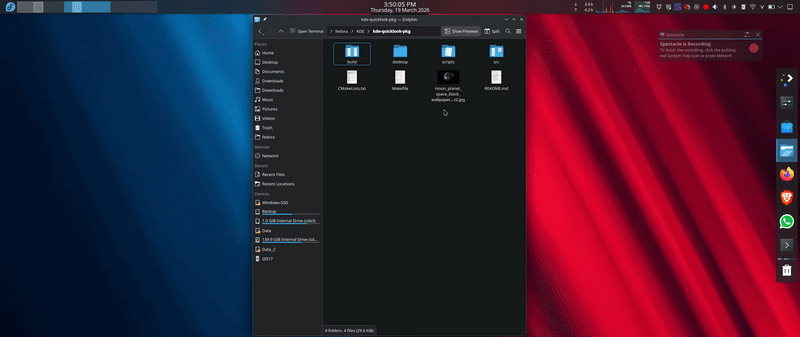

# KDE QuickLook

A macOS-style Quick Look file previewer for KDE Plasma 6 on Fedora.
Select any file in Dolphin, press your shortcut key, and instantly preview it.

---



---
## Features

- 🖼 Image preview (JPEG, PNG, WebP, and more) with dimensions in metadata bar
- 🎞 Animated GIF playback with frame count
- 📄 Text file preview with monospace editor
- 📑 PDF preview with scrollable multi-page rendering
- 🎬 Video playback with play/pause, seek bar, and volume control
- 🎵 Audio playback with album art, title, artist, seek bar and volume
- 📊 Metadata bar showing filename, file size, and modification date
- Press Space or Escape to dismiss (Space toggles play/pause for video/audio)

---

## Requirements

- KDE Plasma 6
- Fedora Linux (tested on Fedora 43)
- Dolphin file manager
- Wayland session

### Build dependencies
```bash
sudo dnf install -y \
  gcc-c++ \
  qt6-qtbase-devel \
  qt6-qtmultimedia-devel \
  qt6-qtmultimedia \
  kf6-kio-devel \
  kf6-ki18n-devel \
  kf6-kservice-devel \
  poppler-qt6-devel \
  taglib-devel \
  wl-clipboard \
  qdbus \
  gstreamer1-plugins-base \
  gstreamer1-plugins-good
```

---

## Installation
```bash
make install
```

That's it. The Makefile will:
1. Generate Qt MOC files
2. Compile the C++ preview binary
3. Install binary to `/usr/bin/`
4. Install launcher script to `~/.local/bin/`
5. Install Dolphin service menu entry
6. Refresh KDE service cache

---

## Setting Up the Keyboard Shortcut

After installing, bind the shortcut (one-time setup):

1. Run: `systemsettings kcm_keys`
2. Click **Add** → **Command or Script**
3. Set:
   - **Name:** `QuickLook`
   - **Command:** `~/.local/bin/dolphin-quicklook.sh`
4. Press **Shift+Space** in the shortcut field
5. Click **Apply**

---

## Usage

1. Open **Dolphin**
2. Click any file to select it
3. Press **Shift+Space**
4. Preview window opens instantly
5. Press **Space** or **Escape** to close

---

## How It Works

The launcher script (`dolphin-quicklook.sh`):
1. Finds Dolphin's DBus service name dynamically
2. Triggers Dolphin's `copy_location` action via DBus
3. Reads the file path from the Wayland clipboard via `wl-paste`
4. Launches `kde-quicklook` with the file path

The preview binary (`kde-quicklook`):
- Detects file MIME type using Qt's QMimeDatabase
- Images → QImageReader with smooth scaling
- GIF → QMovie for animated playback
- PDF → Poppler Qt6 for multi-page rendering
- Video → Qt6 Multimedia with QVideoWidget player
- Audio → Qt6 Multimedia + TagLib for metadata/album art
- Text → QTextEdit in read-only monospace mode

---

## Uninstall
```bash
make uninstall
```

---

## Troubleshooting

**No preview / "No preview available":**
- Check the file is selected in Dolphin before pressing shortcut
- Test directly: `kde-quicklook /path/to/file`

**Audio/Video not playing:**
- Install GStreamer plugins:
```bash
  sudo dnf install -y gstreamer1-plugins-good gstreamer1-plugins-bad-free
```

**PDF shows blank:**
- Ensure poppler-qt6 is installed:
```bash
  sudo dnf install -y poppler-qt6 poppler-qt6-devel
```

**Shortcut not working:**
- Open System Settings → Shortcuts and verify QuickLook is listed

---

## Project Structure
```
kde-quicklook/
├── Makefile                        # Build, install, uninstall
├── README.md                       # This file
├── src/
│   └── quicklook.cpp               # C++ preview binary (all features)
├── scripts/
│   └── dolphin-quicklook.sh        # DBus launcher script
└── desktop/
    ├── dolphin-quicklook.desktop   # Dolphin service menu
    └── quicklook-app.desktop       # Application entry
```

---

## License

GPL v3

---

Built with AI
